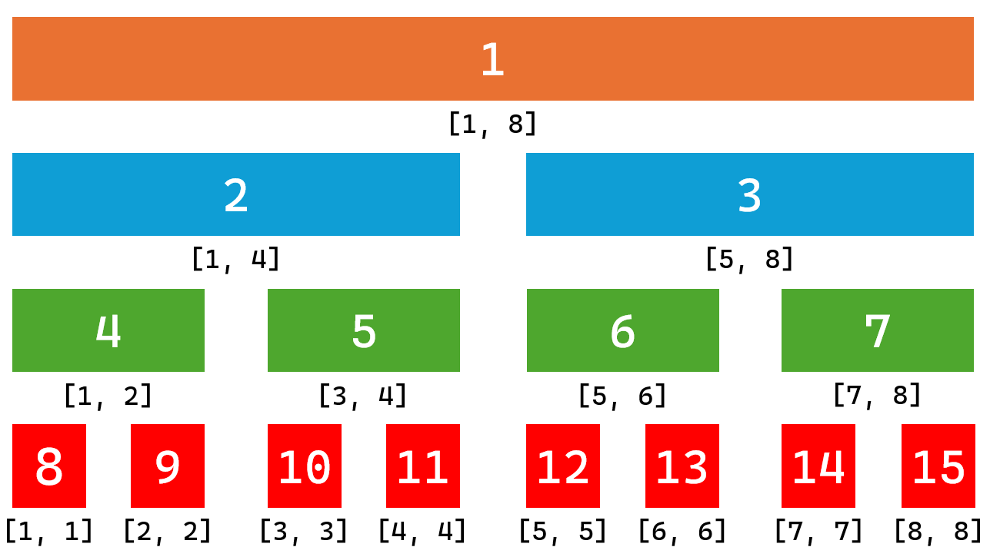
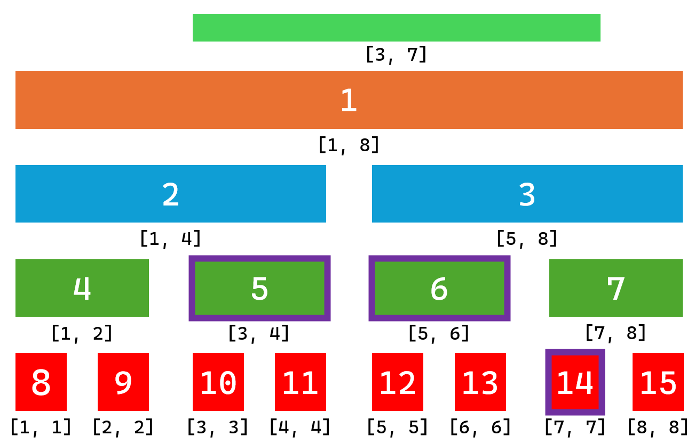
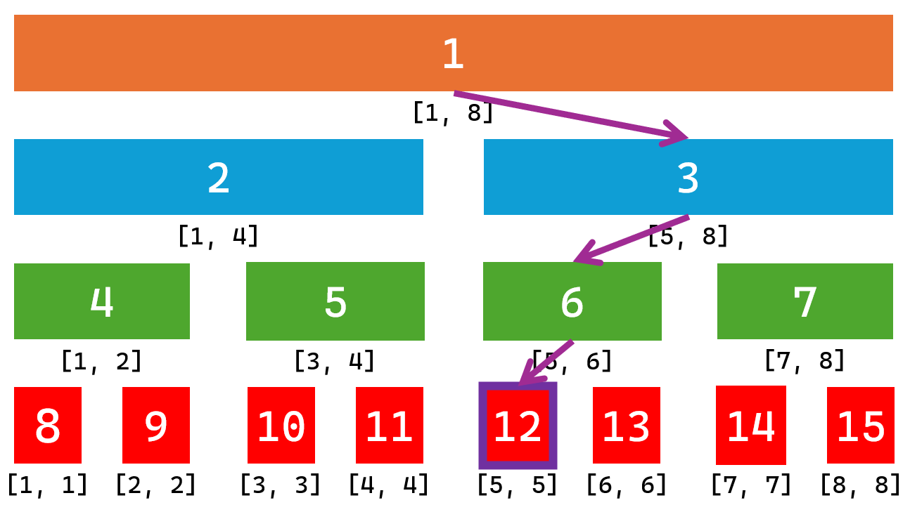

## 前言

线段树作为一种树状数据结构，以其强大的功能和高效的复杂度，成为处理序列等问题的著名数据结构。

从我初中时期刚接触线段树，到高中巩固线段树的理解，以及到大学期间的算法竞赛频繁的使用线段树。它的魔力一直在伴随着每一个热爱算法的人。

<!--more-->
## 经典问题

线段树一般解决的区间操作、区间查询相关的问题。

最简单的就是给定一个长度为 $n$ 的序列 $a$，然后需要执行以下两种操作：

- `pos x`：将 $a[pos]$ 这个数字加 $x$。
- `[l, r]`：输出 $[l, r]$ 这个区间内所有数字的和（两端均为闭区间）。

如果我们只考虑使用数组的循环来解决的话，第一个操作的时间复杂度为 $O(1)$，单次时间复杂度是非常小的。

但是第二个操作，**单次查询**的时间复杂度就非常高了。如果 $[l, r]$ 每一次都是长度为 $n$ 的，那么时间复杂度就为 $O(n)$。

所以这样总的时间复杂度比较的高。

## 线段树

### 一些基础概念

线段树解决以上的问题就非常的简单。

首先线段树是一棵二叉树，线段树上的每一个节点会存储各区间上的信息。

每一个节点上会存储一个节点编号 `id`，以及一个节点代表的区间 `[l, r]` 。

下图为一个长度为 $8$ 的线段树，我们可以发现以下两点性质：

- `id` 号节点的左儿子的编号为 `id*2` ，右节点的编号为 `id*2+1` 。
- 与上一条性质对应的就是区间 $[l, r]$ 的左半部分就是 $[l, mid]$，右半部分为 $[mid+1,r]$



以上的内容都是基于将一个区间分成**左右两个尽可能等长**的区间，这也就是算法中经典的**二分思想**。

在树形结构中，父亲节点一般需要统计儿子节点的信息，在线段树中也是类似的，某个节点的信息一定是通过其左右儿子计算而来的。

以上图 $2$ 节点为例子，这个节点代表的区间为 $[1,4]$，那么它的信息就是通过 $[1,2]$ 这个左区间以及 $[3,4]$ 这个右区间计算得来的，并且不会受到其他非子树内节点的信息的干扰。

而最底层叶子节点的左右端点相同，就可以简单的理解为数组上面单一的元素。

### 建树

这样我们就可以将这棵树用代码的方式建立出来，也就是题目中先给你一个数组，我如何将根据这个数组构建出一棵线段树。

```cpp
const int N = 100005;

struct Info {    // 节点的结构体信息
    int p, l, r; // p 为节点编号，l和r表示区间的左右端点
};

Info seg[N * 4]; // 非动态开点线段树的大小一般需要开原数组的四倍大小
int a[N];        // 给定的原数组

void push(int p) {

}

void build(int p, int l, int r) {
    seg[p] = {p, l, r};
    if (l == r) { 
        // 如果说 l == r 说明已经到了叶子节点
        // 那么就把信息从 a[l](l 为原数组的下标)存到 seg[p] 中(p为线段树中的编号)
        return;
    }
    int mid = (l + r) / 2;
    build(p * 2, l, mid);         // 递归建立左子树
    build(p * 2 + 1, mid + 1, r); // 递归建立右子树
    pushup(p);
}

int main() {
    // ...
    build(1, 1, n);
}
```

以上的代码中出现了一个 `push` 函数，该函数的功能就是将子节点的信息推送给父亲节点，让父亲节点进行计算。（也有很多人写成 `pushup`）

在线段树当中每一个节点都会有信息，但是以上代码中除了对 `l == r` 的叶子节点外都没有进行信息的赋值。

其实对于每一个非叶子节点 $p$ 的信息其实都是通过其左右儿子节点 $leftSon$ 和 $rightSon$ 的信息计算出来的，所以我们只有再递归计算完子节点的信息后，通过子节点的信息再计算出 $p$ 的信息。也就是上面代码中 `push` 函数的作用。

`push(p)` 函数传入一个参数 `p` 表示需要维护节点的编号。在**已知子节点信息正确的情况下**，我们通过 `push` 函数计算出 $p$ 节点正确的信息。

以上就是线段树建树的全部内容了，总的时间复杂度为 $O(n\log n)$。

## 区间求和
### 分析
对于**单点修改、区间查询**题目来说，需要进行区间求和。

假如说先不管修改这个操作。所以我们每一个节点上还需要存储一个信息，也就是 $[l,r]$ 这个区间内所有数字的和 $sum$。

可以通过区间求和这一过程来理解线段树，假如说现在一个节点 $[l,r]$ 对应的总和是 $sum0$，那么这 $sum0$ 是不是也就等于其左区间 $[l,mid]$ 的总和再加上其右区间 $[mid+1,r]$ 的总和。

结合以上分析我们就可以写出本道题目建树相关的代码了。

```cpp
const int N = 100005;

struct Info {    // 节点的结构体信息
    int p, l, r; // p 为节点编号，l和r表示区间的左右端点
    int sum;     // sum 表示 [l, r] 这个区间中所有数的和
};

Info seg[N * 4]; // 非动态开点线段树的大小一般需要开原数组的四倍大小
int a[N];        // 给定的原数组

void push(int p) {
    // 左区间的节点编号为 p * 2，右区间的节点编号为 p * 2 + 1
    seg[p].sum = seg[p * 2].sum + seg[p * 2 + 1].sum;
}

void build(int p, int l, int r) {
    seg[p] = {p, l, r, 0}; // 将所有节点的总和初始化为 0
    if (l == r) { 
        // 如果说 l == r 说明已经到了叶子节点
        seg[p].sum = a[l];
        return;
    }
    int mid = (l + r) / 2;
    build(p * 2, l, mid);         // 递归建立左子树
    build(p * 2 + 1, mid + 1, r); // 递归建立右子树
    pushup(p);
}

int main() {
    // ...
    build(1, 1, n);
}
```

那么接下来就需要解决**区间求和**相关的问题了，也就是给一个查询的区间 $[ql,qr]$ 需要求出区间 $[ql,qr]$ 内所有数字的总和。

假如需要查询 $[3,7]$ 这个区间内所有数字的和，我需要知道哪些区间的信息，也就是这个区间的总和是由哪些区间拼起来的。



如上图所示，需要知道 $[3,7]$ 这个**青色**区间中所有数字的和，需要找到上图中用**紫色**标注出来的节点，这些区间不会**相互覆盖**且可以**精确覆盖**查询区间，比较明显的确定这些区间的总数不会超过 $\log{n}$ 个。

那么现在的问题就是如何找到该区间。

还是需要通过递归进行求解，假如现在递归在节点 $p$，对应的区间为 $[l, r]$，题目要求查询的区间为 $[ql, qr]$，可以进行以下的分类讨论：

- 如果节点 $p$ 对应的区间 $[l, r]$ 和查询区间 $[ql, qr]$ **没有交集**，那么该节点和其子树内就没有我们需要的节点了。比如上图中的 $4$ 号节点。
- 如果节点 $p$ 对应的区间 $[l, r]$ 被查询区间 $[ql, qr]$ **包含**，说明该节点就是需要的节点。比如上图中 $5$ 号节点对应的区间为 $[3,4]$，被查询区间 $[3,7]$ 所包含。
- 否则就说明这当前节点的区间和查询区间有交集，**可以直接递归在左右子树进行查询**。

### 代码实现
```cpp
int querySum(int p, int ql, int qr) {
    int l = seg[p].l, r = seg[p].r;
    if (ql > r || qr < l) {   // 如果两个区间没有交集
        return 0;             // 说明没有答案
    }
    if (ql <= l && r <= qr) { // 如果 p 节点的区间被查询区间包含了
        return seg[p].sum;
    }
    return querySum(p * 2, ql, qr) + 
           querySum(p * 2 + 1, ql, qr); // 否则递归搜索两个子节点。
}
```

> [!TIP]- 证明操作时间复杂度
> TODO：严格证明该操作的复杂度为 $O(\log n)$。（以后有时间就算一下，读者也可以自行推导一下 OvO）

## 单点修改
### 分析
因为修改的是单个的值，而单个元素的值存储的位置就是在叶子节点上，所以需要找到存储该信息的叶子节点。

假设需要对原数组中第 $5$ 个位置的数字进行修改，那么就可以通过递归在线段树上找到对应的节点，如下图所示。



假如现在递归在节点 $p$，对应的区间为 $[l, r]$，区间的中点为 $mid$，题目要求修改的位置为 $pos$，可以进行以下的分类讨论：

- 如果 $pos\leq mid$，说明需要找的节点在左子树。比如查询 $3$ 号节点时该节点的 $mid=\lfloor\frac{(5+8)}{2}\rfloor=6 \geq 5$，所以往 $6$ 节点寻找。
- 如果 $pos> mid$，说明需要找的节点在右子树。比如查询 $1$ 号节点时该节点的 $mid=\lfloor\frac{(1+8)}{2}\rfloor=4 < 5$，所以往 $3$ 节点寻找。

这样一直递归，直到找到叶子节点，也就是 `l == r` 时更新即可。

不过在子节点的值进行更新过，其祖先节点的信息也都需要进行更新，也就是在递归返回的时候需要用 `push` 函数将父节点的信息进行更新。

```cpp
void modify(int p, int pos, int v) { // 将 pos 这个位置上的数字增加 v
    int l = seg[p].l, r = seg[p].r;
    if (l == r) {  // 如果到了叶子节点，可以更新值了
        seg[p].sum += v;
        return;
    }
    int mid = (l + r) / 2;
    if (pos <= mid) { // 如果在左子树，递归左子树
        modify(p * 2, pos, v);
    } else {
        modify(p * 2 + 1, pos, v);
    }
    pushup(p); // 为了维护父亲节点信息的正确性，在递归结束的时候要 push 维护信息。
}
```